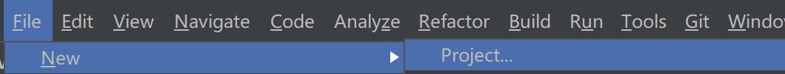
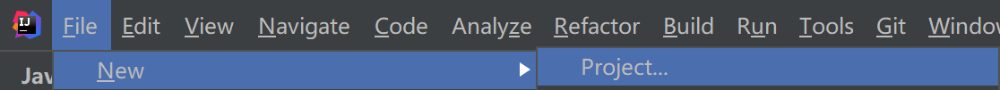
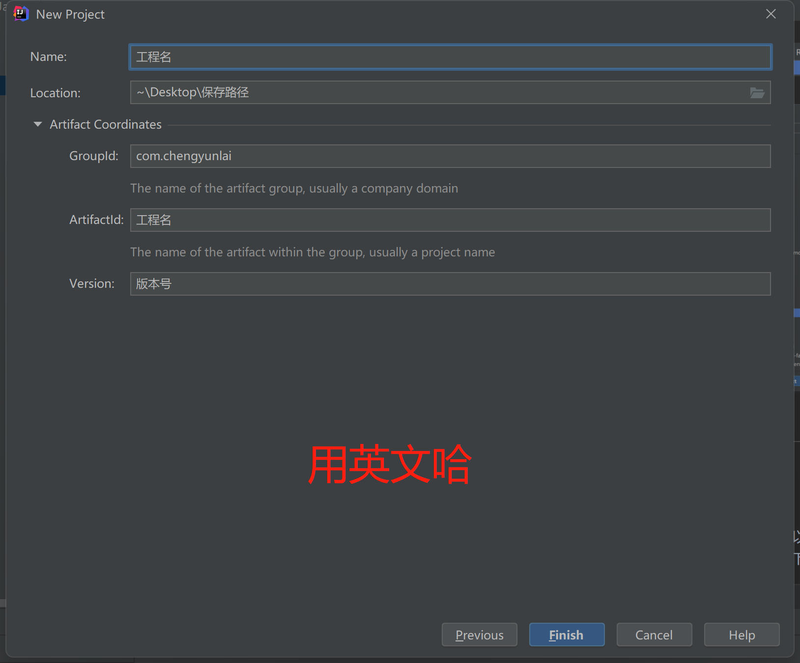
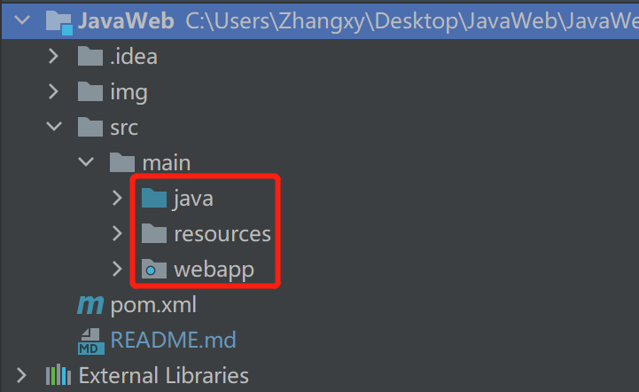

# JavaWeb
***
> 前言
>> 使用空工程和Jar包导入，手动打包管理项目是一件麻烦的事，你需要Maven帮助你管理项目。
>
>> 见过太多纯文本或者只有内嵌代码块的经验分享，还是MD最友好，所以写技术分享还是用MD吧。
>
>> 这个文档适合懂一点Maven知识，懂一点JavaSE，懂一点接口开发思想，懂一点MVC思想，懂一点HTTP
***
## 项目构建
1. 你要先这样

2. 然后再这样

3. 最后要这样

   
这样的项目内置Tomcat服务器，java的代码和前端的代码都包含在这个工程中，运行时打包成war包即可
***
## 目录结构

***
## Maven
Maven最直观的一点就是做到了jar包管理，所以你想使用任何第三方的技术，又不想去网上搜各种jar包自己下载，在Maven工程中，修改**pom.xml**即可

```xml
<dependencies>
    <!--Servlet的jar包-->
    <dependency>
        <groupId>javax.servlet</groupId>
        <artifactId>javax.servlet-api</artifactId>
        <version>3.1.0</version>
    </dependency>  
</dependencies>
```
### Maven仓库
用来搜索Jar包的，地址如下:

`https://mvnrepository.com/`

maven工程还能做jar包版本管理，模块开发，继承打包插件等一些列方便开发的功能，所以直接拿起IDEA创建Maven工程进行开发学习吧
***
## 前后端分离思想
前端不碰后端代码

后端不碰前端代码

**将工程中的jsp文件删除，创建html代码即可，享受极致的前端原生开发；请求发送使用axios技术**

axios是基于Ajax技术的封装，正是因为有它开启了前后端分离

***

## 后端开发的思想 :
开发东西，我们会先从**外向内看**:

- [x] 🥰它得会动，长得好看 
  
- [ ] 🚫然后才会去思考如何去开发

所以我基于这种思想展开来分享一下JavaWeb使用的技术栈。

***

## 前端数据想发送给后端，或者我在网页端如何向一个服务器发请求？

### Servlet
包配置
```xml
<dependency>
    <groupId>javax.servlet</groupId>
    <artifactId>javax.servlet-api</artifactId>
    <version>3.1.0</version>
</dependency>  
```
代码
```java
package top.itifrd.controller.servlet;

import top.itifrd.service.LoginService;
import javax.servlet.*;
import javax.servlet.annotation.WebServlet;
import javax.servlet.http.HttpServlet;
import javax.servlet.http.HttpServletRequest;
import javax.servlet.http.HttpServletResponse;
import java.io.IOException;
import java.io.PrintWriter;

/**
 * @ClassName
 * @Description
 * @Author:chengyunlai
 * @Date
 * @Version 1.0
 **/
@WebServlet("/login")
public class LoginServlet extends HttpServlet {

    @Override
    protected void doPost(HttpServletRequest req, HttpServletResponse resp) throws ServletException, IOException {
        System.out.println("登录成功");

    }

    @Override
    protected void doGet(HttpServletRequest req, HttpServletResponse resp) throws ServletException, IOException {
        System.out.println("doGet");
    }
}
```
假设服务器地址:`http://www.chengyunlai.top`

当你在浏览器输入:`http://www.chengyunlai.top/login` 就表示向服务器发送了一个get请求，而在上述代码中`@WebServlet("/login")` 会匹配到`/login`处理该请求，执行doGet方法
***


